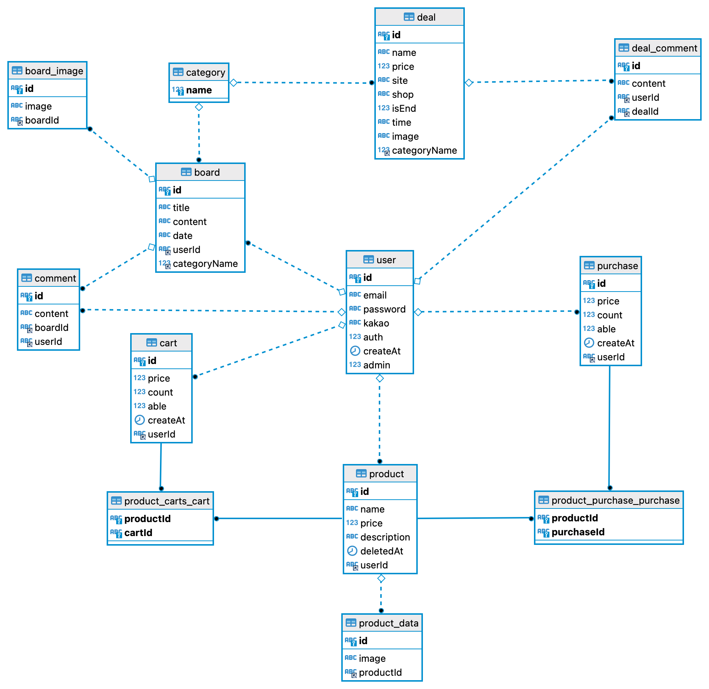
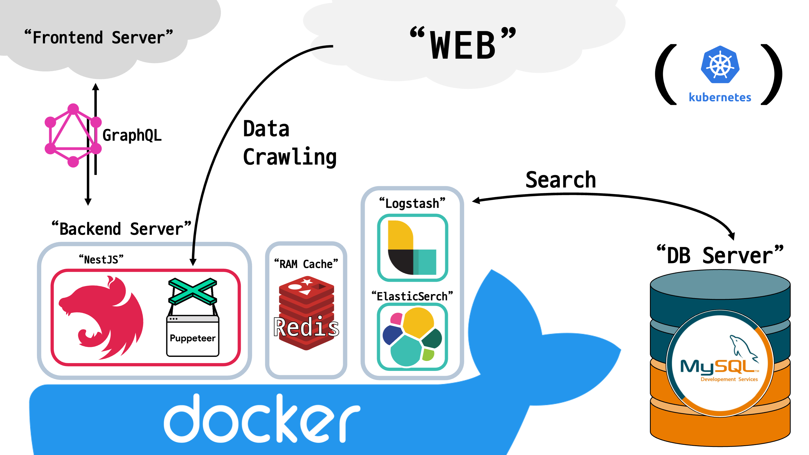

# PriceCrawler

> To Buy or Not to Buy, therefore I buy.  
> 알뜰해서 핫딜을 찾는게 아니라 핫딜을 찾다보니 알뜰이더라


[https://github.com/SukbeomH/PriceCrawler](https://github.com/SukbeomH/PriceCrawler)

여기저기 널리 퍼진 커뮤니티의 핫딜 게시판을 공유합니다. 알구몬의 클론 프로젝트를 표방 중입니다.  
알구몬 : https://algumon.com/

## ERD



## Pipeline



## Prerequisites :: 설치 전에 확인할 것, 개발 환경 설정

Before you begin, ensure you have met the following requirements:  
시작하기 전에, 요구사항을 충족하는지 확인해주세요:

<!--- These are just example requirements. Add, duplicate or remove as required --->

- You have installed the latest version of `Docker`
- You have installed the latest version of `Docker-compose`

- `Docker` 최신 버전
- `Docker-compose` 최신 버전

## Installing <PriceCrawler> :: 설치 방법

```
docker compose -f docker-compose.yaml build
docker compose -f docker-compose.yaml up
```

## .ENV <PriceCrawler> :: 환경변수 설정

```
# MYSQL
MYSQL_PSWD=

# IAMPORT
IAMPORT_API_KEY=
IAMPORT_SECRET=

# OAUTH_GOOGLE
OAUTH_GOOGLE_ID=
OAUTH_GOOGLE_SECRET=
OAUTH_GOOGLE_CALLBACK=

# OAUTH_KAKAO
OAUTH_KAKAO_ID=
OAUTH_KAKAO_CALLBACK=

# OAUTH_NAVER
OAUTH_NAVER_ID=
OAUTH_NAVER_SECRET=
OAUTH_NAVER_CALLBACK=

#BACKEND_ACCESS
BACKEND_ACCESS_KEY=
BACKEND_REFRESH_KEY=

#GCP_STORAGE
STORAGE_BUCKET=
STORAGE_KEY_FILE=
STORAGE_PROJECT_ID=

#GCP_BIGQUERY
GCP_BIGQUERY_TABLE=
GCP_BIGQUERY_DATASET=
BIGQUERY_PROJECT_ID=
BIGQUERY_KEY_FILENAME=
```

## Updates :: 업데이트 내역

- 0.0.1
  - 작업 진행 중

## INFO :: 정보

SukbeomH – brent93.dev@gmail.com

## License

<!--- If you're not sure which open license to use see https://choosealicense.com/--->

This project uses the following license: [<MIT>](https://choosealicense.com/licenses/mit/#)MIT

<!-- Markdown link & img dfn's -->

[npm-image]: https://img.shields.io/npm/v/datadog-metrics.svg?style=flat-square
[npm-url]: https://npmjs.org/package/datadog-metrics
[npm-downloads]: https://img.shields.io/npm/dm/datadog-metrics.svg?style=flat-square
[travis-image]: https://img.shields.io/travis/dbader/node-datadog-metrics/master.svg?style=flat-square
[travis-url]: https://travis-ci.org/dbader/node-datadog-metrics
[wiki]: https://github.com/yourname/yourproject/wiki
